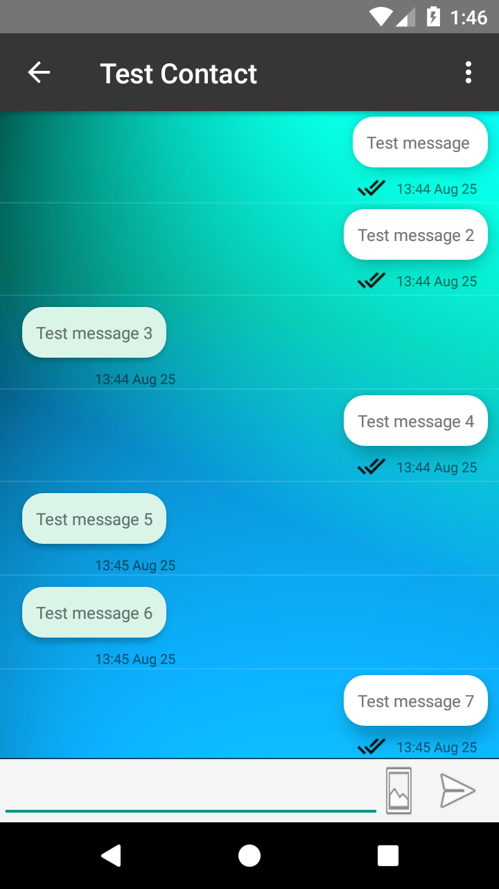

# Messenegr Application
Android Messenger application written in Java and developed with Android Studio. Including costum-made TCP-based protocol, written in 
Python, to mannage communication between clients.

## Screenshot

## Setup
Set server's IP address and port and run on an android device. App will be installed and initiated on first run. 

## Features
- Supports Text and media messages.
- Messages management tools.
- Sent messages status (recieved and read) updates.
- Group chats including admin managing tools.
- Includes profile image and status.
- Income message notifications.
- Supports device's contacts list.

## Server's Features
- Text and file transfer.
- Pending messages and requests.
- Users profile updates.
- Registered contacts filter.
